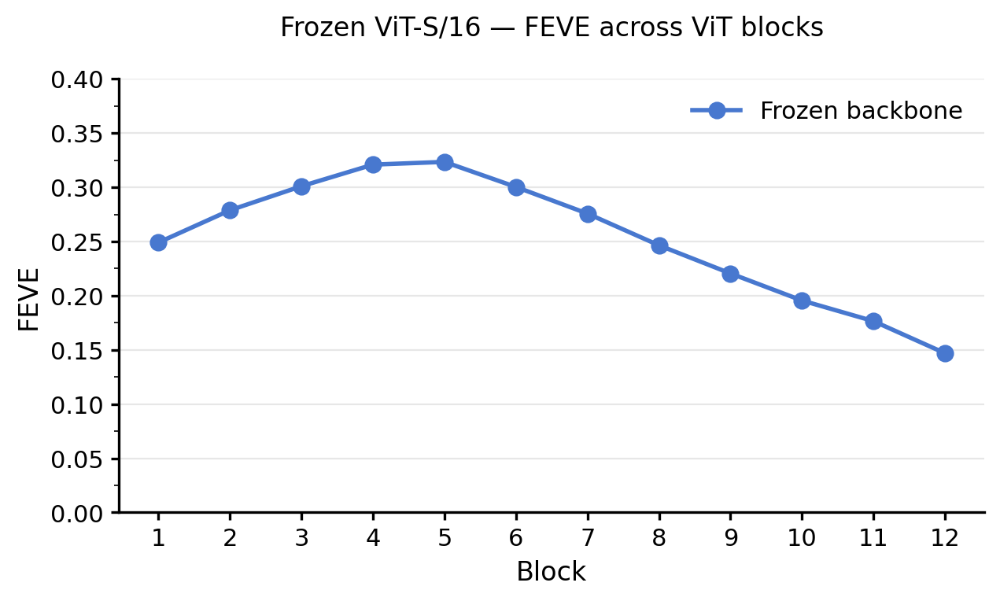
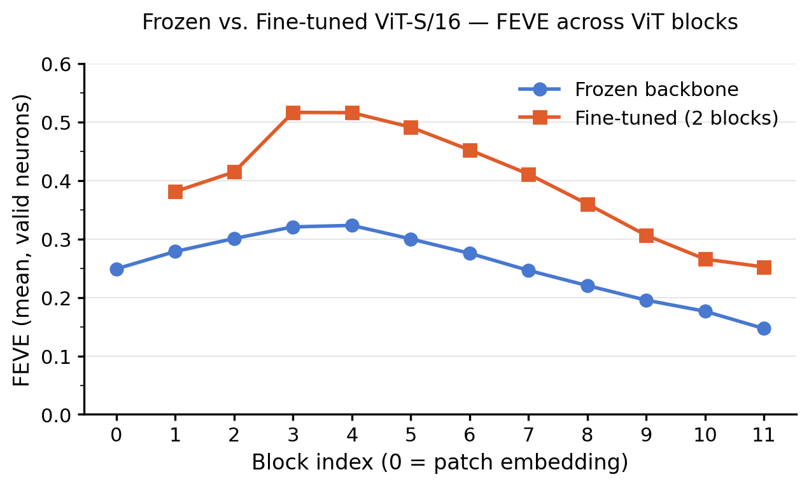
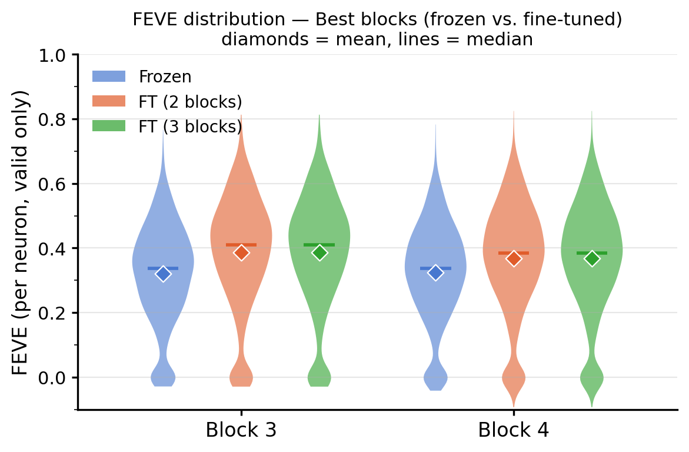
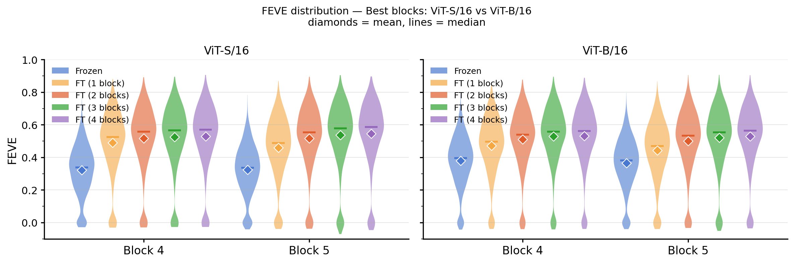
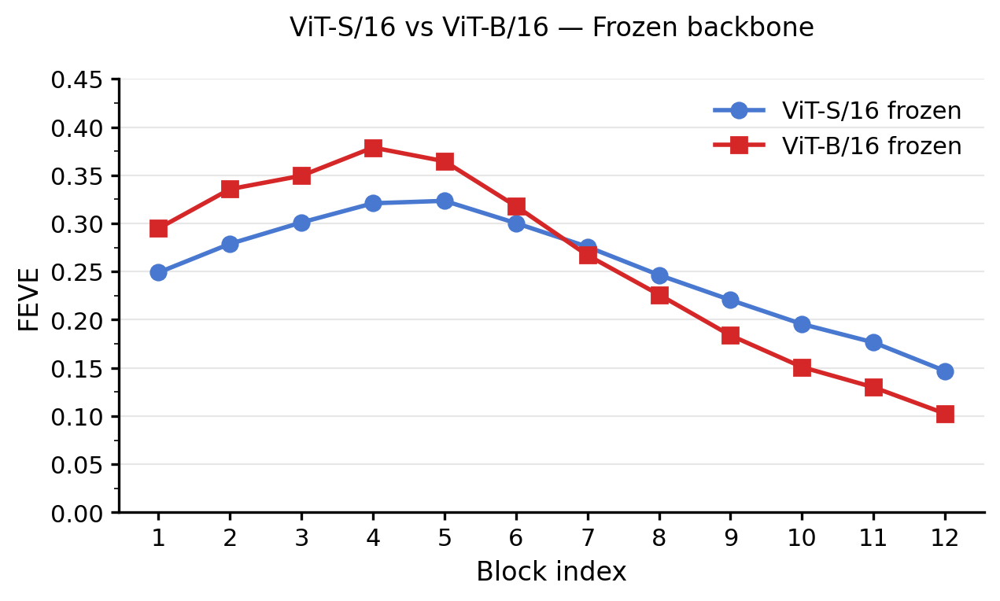
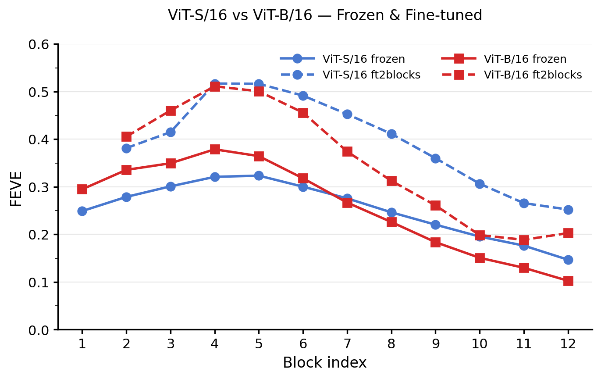
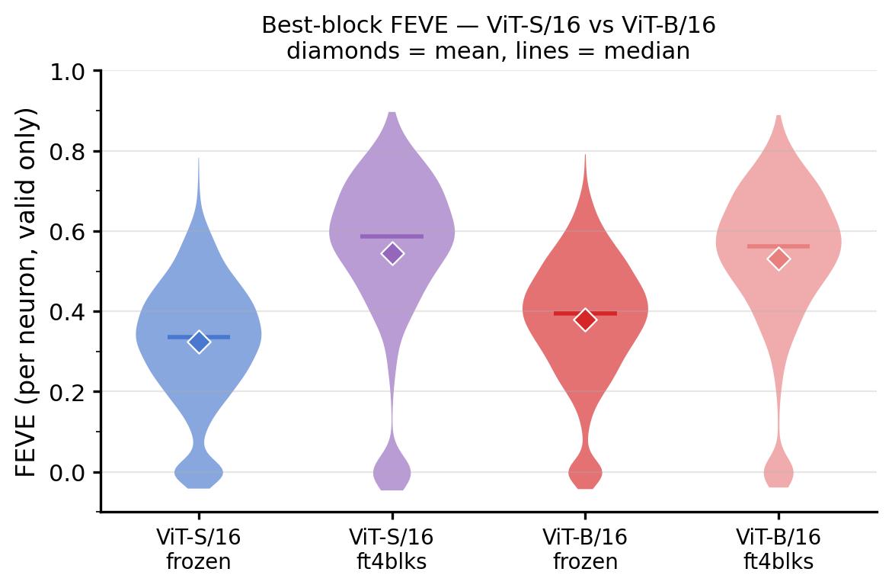

# minimodel-vit

Encoding models for mouse primary visual cortex (V1) using a Vision Transformer (ViT) backbone with the [minimodel](https://github.com/MouseLand/minimodel) readout. The project asks a simple question: **can we directly plug frozen (or lightly fine-tuned) DINOv3 patch features with the minimodel readout and match the performance of the task-optimized CNN core?**

Two training regimes are compared:

1. **Frozen backbone** — the ViT is used purely as a feature extractor; only the readout is trained.
2. **Fine-tuned backbone** — the last *N* transformer blocks are unfrozen and jointly optimized with the readout at a lower learning rate.

Results are compared against the CNN fullmodel (2-layer depth-separable convolutional core + readout) to assess what large-scale visual pretraining adds to neural predictivity.

---

## Model structure

### Image preprocessing

Raw stimuli are 66 × 264 grayscale images displayed on a wide-field monitor. Before entering the ViT, each image is resized and cropped to match the receptive-field coverage of the recorded neurons:

```
66 × 264  →  resize  →  64 × 256
          →  crop (left half)  →  64 × 128
          →  per-image [0, 1] normalization
          →  replicate to 3 channels  (grayscale → pseudo-RGB)
          →  ImageNet normalize  (mean=[0.485, 0.456, 0.406], std=[0.229, 0.224, 0.225])
```

Output: `(N, 3, 64, 128)` tensors fed to the ViT.

### ViT backbone (DINOv3 ViT-Small / ViT-Base)

| Property | ViT-S/16 | ViT-B/16 |
|---|---|---|
| HuggingFace ID | `facebook/dinov3-vits16-pretrain-lvd1689m` | `facebook/dinov3-vitb16-pretrain-lvd1689m` |
| Parameters | ~21 M | ~86 M |
| Patch size | 16 × 16 | 16 × 16 |
| Embedding dim | 384 | 768 |
| Transformer blocks | 12 | 12 |
| Spatial output grid | 4 × 8 (from 64 × 128 input) | 4 × 8 |
| Register tokens | 4 (DINOv3) | 4 |

Features can be extracted from any of the 12 transformer blocks, giving 12 possible readouts in total.

### Architecture: how ViT and readout are concatenated

The overall pipeline is:

```
Input image (N, 3, 64, 128)
      ↓  resize to ViT input size
      ↓  ViT backbone (frozen or partially fine-tuned)
      ↓  extract patch tokens from block k  →  (N, num_patches, D)
      ↓  drop CLS + register tokens, reshape to spatial grid
patch features  (N, D, 4, 8)         ← D = 384 (ViT-S) or 768 (ViT-B)
      ↓  Wc  (n_neurons, 384/768)        ← channel weights (linear combination)
      ↓  Wy ⊗ Wx  (n_neurons, 4, 8) ← rank-1 separable spatial weights (≥ 0)
      ↓  ELU + bias
      ↓  + 1  (Poisson output shift)
predicted firing rates  (N, n_neurons)
```

The key design choice is that **each 16×16 patch token is treated as one spatial location** in a 4×8 grid. The readout from the minimodel learns a per-neuron separable weight map over this grid and a linear combination of feature channels. This is identical to the readout applied to the CNN core feature maps.

### Training protocol

**Frozen backbone:**
- Only the readout parameters (`Wc`, `Wy`, `Wx`, `bias`) are optimized.
- Optimizer: AdamW, `lr=1e-3`, L2 on `Wc` (`l2_readout=0.1`).
- LR scheduler: ReduceLROnPlateau (halve when val varexp stalls, patience=5).
- Early stopping when LR reaches `min_lr=1e-5`.

**Fine-tuned backbone:**
- Initialized from the frozen-backbone checkpoint.
- Last *N* transformer blocks unfrozen (experiments: N = 1, 2, 3, 4).
- Three learning-rate groups: backbone `lr=1e-5`, readout `lr=1e-3`.
- LR schedule: CosineAnnealingLR over max 100 epochs.
- Early stopping (patience = 5, up to 100 epochs).

---

## Results

All results are on mouse **FX10** (4,792 neurons, 500 held-out test images × 10 repeats). Valid neurons are defined as FEV > 0.15 (approximately 3,040 / 4,792 neurons). FEVE (fraction of explainable variance explained) is averaged over valid neurons.

### Figure 1a — FEVE by block (frozen ViT-S/16)

<div align="center"></div>

Frozen ViT-S/16 features extracted from each transformer block. FEVE peaks at **block 5 (~0.32)**, indicating that low-to-mid-level representations are most predictive of V1 responses. Performance declines steadily in later blocks as representations become more semantic.

### Figure 1b — Frozen vs. Fine-tuned ViT-S/16

<div align="center"></div>

Fine-tuning the last 2 blocks consistently improves FEVE across all ViT depths. The fine-tuned peak rises to **block 4–5 (~0.52)**, up from ~0.32 frozen. The block-ordering of performance is preserved after fine-tuning.

### Figure 2 — FEVE distribution at best blocks (ViT-S/16)

<div align="center"></div>

Violin plots of mean FEVE at blocks 4 and 5 across five conditions: Frozen, FT-1, FT-2, FT-3, and FT-4 blocks. Fine-tuning raises the mean FEVE progressively with each additional unfrozen block, from **~0.32 (frozen)** to **~0.54 (FT-4 blocks)**. 

### Figure 2b — Best-block FEVE distribution (ViT-S vs. ViT-B, all fine-tuning levels)

<div align="center"></div>

Comparison of mean FEVE at the best block for ViT-S/16 and ViT-B/16 across all fine-tuning conditions. In the frozen setting, ViT-B/16 outperforms ViT-S/16 (0.38 vs. 0.32). After fine-tuning 4 blocks, **ViT-S/16 slightly surpasses ViT-B/16** (0.5449 vs. 0.5309), suggesting the smaller model adapts more efficiently with our data.

### Figure 3 — ViT-S/16 vs. ViT-B/16 (frozen)

<div align="center"></div>

Comparing frozen ViT-Small and ViT-Base. ViT-B/16 outperforms ViT-S/16 in early-to-mid blocks, peaking at **block 4 (~0.38 vs. ~0.32)**. 

### Figure 4 — All conditions (frozen & fine-tuned, ViT-S and ViT-B)

<div align="center"></div>

Comparison across both model sizes and training regimes. All curves peak around blocks 4–5. Fine-tuning narrows the gap between ViT-S and ViT-B. Later blocks show divergent behavior after fine-tuning, likely due to overfitting with less-predictive features.

### Figure 5 — Best-block FEVE (ViT-S vs. ViT-B, frozen and FT-2)

<div align="center"></div>

Mean FEVE at the best block, comparing frozen and FT-4-block conditions for both architectures. Fine-tuning 4 blocks improves the performance relative to the old runs, reaching ~0.54 for both ViT-S and ViT-B.

### Summary table

| Model | Best block | FEVE (mean, valid neurons) |
|---|---|---|
| CNN fullmodel (2-layer depth-sep. conv, 16/320 filters) | — | **0.6654** |
| ViT-S/16 frozen | 5 | 0.3234 |
| ViT-S/16 FT-1 block | 4 | 0.4896 |
| ViT-S/16 FT-4 blocks | 5 | **0.5449**  |
| ViT-B/16 frozen | 4 | 0.3787 |
| ViT-B/16 FT-1 block | 4 | 0.4712 |
| ViT-B/16 FT-4 blocks | 4 | 0.5309 |
| ViT-B/16 FT-4 blocks (upsample 2x) | 4 | **0.6352** (best) |


With 2× input upsampling, the best ViT model (ViT-B/16 FT-4 blocks) reaches **0.6352 FEVE**, closing most of the gap to the CNN fullmodel at **0.6654 FEVE** — within ~0.03 of the task-optimized baseline.

---

## Discussion

### Spatial resolution is the key bottleneck

The single largest performance gain in this project came not from architecture choice or fine-tuning depth, but from **input upsampling**. Upsampling the stimulus from 64×128 to 128×256 before feeding the ViT doubles the spatial resolution of the patch grid (from 4×8 to 8×16), and pushes FEVE from ~0.53 to **0.6352** — within 0.03 of the CNN fullmodel.

This result directly implicates spatial precision as the primary bottleneck. Mouse V1 neurons have small, spatially localized receptive fields. When the ViT operates on a coarse 4×8 grid of 16×16-pixel patches, the readout has only 16-pixel spatial granularity — insufficient to resolve fine RF structure. The CNN fullmodel, processing images at full resolution through convolutional layers with dense spatial feature maps, naturally avoids this constraint. Doubling the resolution effectively bridges most of that gap.

### Self-attention mixes spatial information

Even at the best-performing blocks (4–5 out of 12), ViT patch tokens have already exchanged global context through self-attention. This is fundamentally at odds with V1 neurons, which integrate signals from spatially localized regions. Fine-tuning partially mitigates this by adapting the attention patterns toward more spatially localized representations, but some mixing is inherent to the transformer architecture.

### Block depth: mid-early layers best predict V1

FEVE consistently peaks at blocks 4–5 for both ViT-S and ViT-B, across all training regimes. This mirrors findings from neural predictivity studies in primates: mid-early ViT layers align best with V1/V2, while later layers better predict higher visual areas (V4, IT). The result suggests that the organizational hierarchy of DINOv3 representations partially maps onto the mouse visual hierarchy.

### Fine-tuning

Fine-tuning consistently improves FEVE, with the largest single jump at frozen → FT-1 (~0.16–0.17 FEVE). Returns diminish at FT-3 and FT-4, suggesting that most of the representational adaptation occurs in the first unfrozen block. The pretrained DINOv3 features are substantially adaptable to neural prediction, but the backbone does not need deep unfreezing to benefit.

### ViT-S vs. ViT-B

ViT-B/16 (86 M params) outperforms ViT-S/16 (21 M params) in the frozen regime (0.38 vs. 0.32), consistent with the larger model having more expressive general-purpose features. After fine-tuning 4 blocks without upsampling, the gap narrows and reverses slightly (ViT-S 0.5449 vs. ViT-B 0.5309), possibly because the smaller model overfits less on our relatively small neural dataset. 


## Requirements

```
torch >= 2.0
torchvision
numpy
scipy
opencv-python
transformers
tqdm
matplotlib
```
